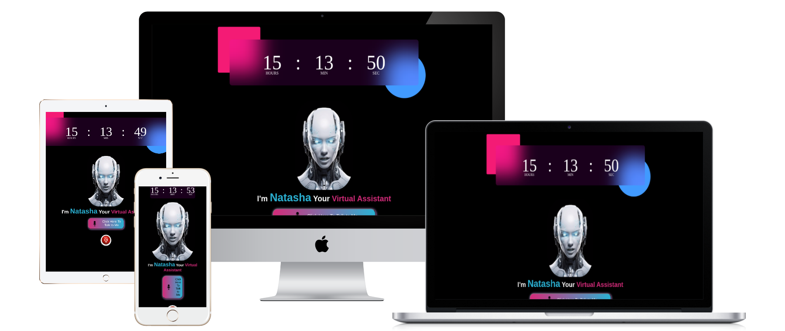

#  Web Assistant - Natasha

Natasha AI is a virtual assistant built using HTML, CSS, and JavaScript. She provides a user-friendly interface for users to interact with her and perform various tasks.

## Table of Contents
* [About Natasha](#about-natasha)
* [Features](#features)
* [Technologies Used](#technologies-used)
* [Usage](#usage)
* [License](#license)
* [Assistent License](./pages/license.txt)
* [Acknowledgments](#acknowledgments)
* [Future Plans](#future-plans)
* [FAQ](#faq)
* [Color Reference](#color-reference)
* [Github Profile](#github-profile)
* [Author](#author)
* [HarshTech Organization](#about-harshtech)
* [Demo](#live-project-link)
* [Feedback](#feedback)
* [Deployment](#deployment)
* [Lessons](#lessons)
* [Logo](#logo)
* [Optimizations](#optimizations)
* [Roadmap](#roadmap)
* [Screenshots](#screenshots)
* [Support](#support)
* [Used By](#used-by)

# About Natasha
Hi, I'm Natasha! I'm a virtual assistant designed to assist you with various tasks and answer your questions. I'm built using cutting-edge technology and am constantly learning to improve my responses.

* Conversational Interface: I provide a conversational interface for users to interact with me.
* Command Recognition: I recognize various commands and perform tasks accordingly.
* Typing Effect: I display a typing effect to simulate human-like conversation.
* Responsive Design: I'm fully responsive and work on various devices.

## Features
* This Virtual assistent perform the basic tasks of browser.
* It's perform the task depending upon the user voice commands.
* Various AI system included.

## Technologies Used 
* HTML: Used for structuring the content and creating the user interface.
* CSS: Used for styling the content and creating a visually appealing design.
* JavaScript: Used for creating the conversational interface, command recognition, and typing effect.

## Usage 
* This is used for perform the basic tasks of Browser

## License
* Thia project do not required any license.

## Acknowledgments
* Inspiration: The project was inspired by various virtual assistant projects.
* Resources: The project uses various resources, including online tutorials and documentation.

## Future Plans
* Improve Command Recognition: Improve the command recognition system to recognize more commands and perform tasks more accurately.
* Add More Features: Add more features to the project, such as integration with other services or applications.
* Improve User Interface: Improve the user interface to make it more visually appealing and user-friendly.

## FAQ
* Q: What is Natasha AI?
A: Natasha AI is a virtual assistant built using HTML, CSS, and JavaScript.
* Q: How do I interact with Natasha?
A: You can interact with Natasha by voice commands.
* Q: What kind of tasks can Natasha perform?
A: Natasha can perform various tasks, such as answering questions, opening web tools , and more.

## Color Reference
* Primary Color:pink,red,
* Secondary Color:light green,light blue
* Background Color:black

## Github Profile
* Introduction: Hi, I'm Harshad Teli, a developer and designer passionate about building innovative projects like Natasha AI.
* Github: [https://github.com/harshadteli](https://github.com/harshadteli)

## Author
* Name: Harshad Teli
* Email: [harshadteli697@gmail.com](mailto:harshadteli697@gmail.com)
* Contact on: [https://harshadtelicontact.org](https://harshadteli.github.io/contactharshadteli/)

## About HarshTech
* This organization can developed the interactive projects for upcoming modern technology.
* Founder: Harshad Teli
* Contact us: [https://harshtechcontactform.org](https://harshadteli.github.io/contactharshtech/)
* Follow on:-  

## Live Project Link
* [Live Project](https://harshadteli.github.io/natashaserveraitechnology/)

## Feedback
* You can submit your form about our technology through below link
* Feedback: [https://natashfeedback.org](https:/harshadteli.github.io/feedbackformgithub/)

## Deployment
* This project is deployed on GitHub Pages by HarshTech Organization.

## Lessons
* Learned about building conversational interfaces using HTML, CSS, and JavaScript 

## Logo
* 
* The logo represents the futuristic and innovative design of Natasha AI.

## Optimizations
* Optimized code for better performance and faster loading times.
* Used efficient algorithms and data structures to improve command recognition and response times.
* Implemented caching to reduce the number of requests made to the server.
* Minified and compressed code to reduce file size and improve page load times.

## Roadmap
* **Short-term goals**:
+ Improve command recognition accuracy
+ Add more features to the project
+ Enhance user interface and user experience
* **Long-term goals**:
+ Integrate with other services and applications
+ Develop a more advanced AI model for better responses
+ Expand the project's capabilities to include more tasks and features
* **Future milestones**:
+ Version 2.0: Improved command recognition and new features
+ Version 3.0: Integration with other services and applications
+ Version 4.0: Advanced AI model and expanded capabilities

## Screenshots

These screenshots showcase the project's user interface and features.

## Support
If you need help with using Natasha AI or have any questions, you can:

* Check the [FAQ](#faq) section for answers to common questions
* Open an issue on GitHub to report a bug or request a feature
* Contact the author directly via email

## Used By
Natasha AI is used by:

* Developers who want to learn about building conversational interfaces
* Researchers who want to study human-computer interaction
* Anyone who wants to use a virtual assistant for tasks and questions

If you're using Natasha AI, feel free to let us know!

&copy; 2025 HarshTech Organization | All rights reserved

    

